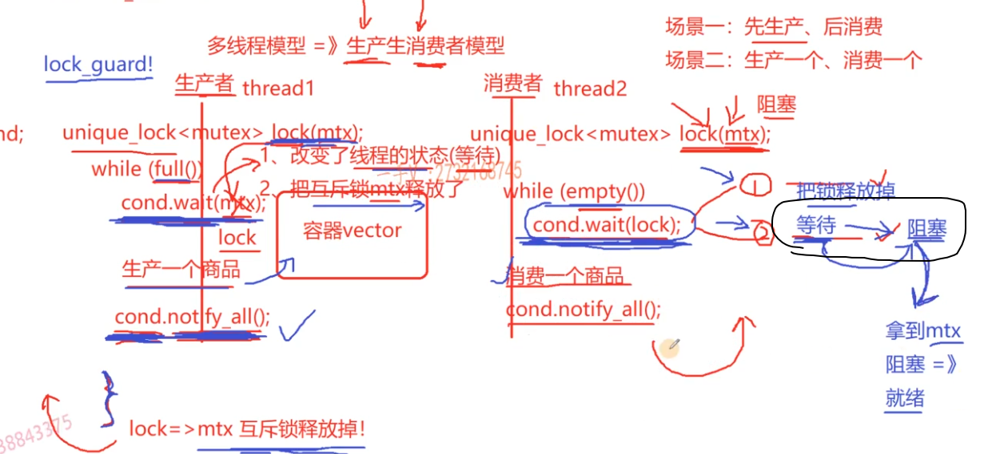

# 线程池项目

## 并发和并行

* 并发：对于每一个CPU的核（一个线程），以一定的调度方式（时间片轮转）调度多个任务，呈现宏观上的并发执行。

* 并行：对于多核CPU或多CPU，不同的任务可以同一时间同时运行。

## 多线程优势

多线程程序不是一定好，需要看见具体场景。

### IO密集型

IO密集型任务：程序的指令涉及IO操作，如文件相关、网络相关。（IO操作可能阻塞当前程序，所以要使用多线程方式）
对于IO密集型任务，无论CPU类型是单核，还是多CPU，都是比较适合设计成多线程程序。

### CPU密集型

CPU密集型任务：程序指令都是用于计算的任务。（深度学习类）
对于**单核CPU**，由于多线程存在上下文切换，且CPU密集型任务不涉及阻塞IO操作，所以单核CPU更适合采取一个线程。
对于多核CPU，可以设计成多线程方式，提升CPU利用率。

## 怎么确定线程数量

### 线程的消耗

1. 线程的创建和销毁比较耗费资源 “重”（内核态空间切换、创建PCB、线程内核栈、页表、描述地址空间的数据结构等）
2. 线程栈占用大量内存（每个线程都需要一个线程函数，线程栈指的是线程中线程函数所占的内存空间（8M））
3. 线程的上下文切换要占大量时间
4. 大量线程同时唤醒，可能会使系统出现锯齿状负载，或瞬间大负载导致宕机
IO复用+多线程方式实现高并发（多线程数量一般都是按照当前CPU核数决定的）

## 线程池

### 优势

由于线程池创建和销毁比较重，所以提前创建一些线程，用来给业务层使用，当任务完成后，线程归还到线程池，而不销毁。
线程池的线程个数是固定不变的，一般是ThreadPool创建时根据CPU核数指定的。

### 线程池模式

1. fixed模式：线程池的线程数量在初始化时固定，一般根据CPU核数设定
2. cached模式：动态模式，有最小数量（初始化数量）和最大数量，超过最小数量的线程在空闲一段时间后要释放 适合小而快的任务

## 线程池中的同步和互斥

### 线程同步

线程同步包含两个事：线程互斥和线程通信
如果代码片段存在临界区代码段（存在竞态条件的代码称为临界区代码，竞态指的是代码片段在多线程环境下执行，随着线程的调度顺序不同，可能有不同的结果），那么该段代码片是**不可重入**的。临界区代码段需要使用互斥锁保证代码的原子操作。（如果锁的加锁释放比较频繁，可以用trylock，活锁、乐观锁）

1. 线程互斥
   1. 互斥锁
   2. atomic原子类型
   3. CAS操作（Compare and Set，无锁机制），无锁队列、无锁链表等。（使用一种类似于trylock活锁的CAS操作）
2. 线程通信

   1. 条件变量：条件变量需要与互斥锁配合使用。
      1. 在消费者调用cond.wait时做了两件事：释放互斥锁进入阻塞等待（cond）状态；在生产者cond.notify_all()时，消费者也做了两件事：从等待状态中唤醒，尝试获得（类似轮询）互斥锁。线程阻塞在condition_variable时，它是等待notify_one()或者notify_all()来唤醒，而不是等待锁可以被锁定来唤醒。 线程被唤醒后，会通过轮询方式获得锁，获得锁前也一直处理运行状态，不会被再次阻塞。
      2. 条件变量的使用流程如下
   2. 信号量 c++20提供

```c++
    void consumer(){
        // 加锁
        std::unique_lock<std::mutex> lk(cv_m);
        cv.wait(lk, []{return dataReady;}); // 会对lk解锁，然后等待cv信号；唤醒后，尝试获得互斥锁
    }
    void producer(){
        // 加锁
        std::unique_lock<std::mutex> lk(cv_m);
        // 更新谓词
        dataReady = true;
        // notify
        cv.notify_one(); // 唤醒cv阻塞线程
    }
```

注意：条件变量在使用时，notify_all前需要使用互斥锁，原因是如果通知前不加锁，可能由唤醒丢失情况导致死锁：以下消费者等待函数中，其实是在做(2)，在（2）中两条语句之间是有空挡的（不是原子操作），那么，在notify_all前不加锁的情况下，如果在空挡时期生产者notify_all，那么就会发生**唤醒丢失**。造成生产者继续wait条件变量，而生产者如果不会在notify_all的话，就会导致死锁。

```c++
    cv.wait(lk, []{ return dataReady; });  （1）

    while(!dataReady){
        cv.wait(lk);                        (2)
    }
```

当用于生产者消费者模型时，代码如下。生产者当队列为空的时候向队列塞数据；消费者当队列不为空的时候拿数据，此时队列是否为空就代替了上边dataReady（谓词）的作用，生产者在上锁后，向队列塞数据，就代替了上边的更新谓词的作用。

```c++
    void producer(){
        for (;;)
        {
            unique_lock<mutex> lock(_queueMutex);
            while (!_connectionQue.empty())
            {
                cv.wait(lock); // 队列不空，此处生产线程进入等待状态
            }

            // 连接数量没有到达上限，继续创建新的连接
            if (_connectionCnt < _maxSize)
            {
                Connection *p = new Connection();
                p->connect(_ip, _port, _username, _password, _dbname);
                p->refreshAliveTime(); // 刷新一下开始空闲的起始时间
                _connectionQue.push(p);
                _connectionCnt++;
            }

            // 通知消费者线程，可以消费连接了
            cv.notify_all();
        }
    }
```

**信号量**是另一种线程通信的方式。信号量可以看作资源计数没有限制的互斥量。互斥锁可以在做计数值为0或1的信号量。

但是二者也有不同：

1. 互斥量的申请和释放需要在同一个线程，即哪个线程获得锁，哪个线程释放锁
2. 信号量则不同，sem.wait和sem.post可以在不同的线程中调用
3. 信号量调用post会使信号量加一，无论当前线程有没有wait到信号量，而互斥量的unlock，只会在当前线程获取锁的前提下，调用unlock才会释放互斥锁。

信号量可以模拟互斥锁，即初始化sem为1，每次在申请访问临界区的代码中先wait，进入后完成操作后在post，这样就能保证每次只有一个线程进入临界区了。

信号量PV操作

1. P就是wait操作
2. V就是post操作

## 项目开始

### 线程池ThreadPool架构

1. 定义线程池对象，设置模式，开始运行线程池
2. 向线程池提交任务，获取返回值（适配多种返回值类型）
3. 创建容器存放线程和任务（任务要适配多种函数类型）

### 智能指针

采用智能指针管理线程和任务
当把智能指针push进容器时，最好用shared_ptr，相当于拷贝构造了一个智能指针，此时的use_count增加一(作为函数参数时，也会拷贝一份，count也会加一)

### 设计run函数返回值表示任意类型？

返回结果类型不一，但是不能用模板。因为模板和virtual不能结合使用，虚函数表里的虚函数存在模板的话没有确定，所以不可以
解决思路仿照 Python或Java中Object基类的思想，C++17中给了Any类型，是一切类型的基类

#### 手动构建Any类型

1. 怎么表示任意的其他类型？ Template
2. 怎么让一个类型指向其他任意类型？ 使用一个基类指针可以指向其任意派生类

### 如何设计提交任务后的结果返回机制？

需要设计一个模板函数用于使用base指针，拿到派生类成员变量（结果）。
需要先使用强制类型转换dynamic_cast把指向派生类的基类指针转化为派生类指针，需要保证传入的类型名和派生类内部收到的数据类型相同，否则会返回空指针
如果传入的类型名正确，可以拿到非空派生类指针，之后return成员变量即可。

注意，模板代码最好全部都放在头文件，除非在每个源文件都进行如下声明：

```c++
template Derive<int> // 进行额外声明
```

设计了一个Result类用来保存任务返回结果，在提交任务的函数中，返回结果时，不可以用这种：

```c++
return task->getResult();   // 原因是在task->run执行完后，task被智能智能管理会被析构掉，
```

注意：

1. 在submitTask函数里，需要返回Result对象，由于Result对象里有Any类型的成员变量，Any类禁止拷贝构造，而因为函数里创建的res为临时变量，不可以返回右值引用，可行的解决办法是：返回类型为Result，做值传递返回。但是，在程序中，返回Result对象时，编译器会自动考虑拷贝构造函数，而Any类禁止拷贝，所以会出错，这是编译器优化的问题。
2. 因此，不考虑值传递返回了，返回一个Result的智能指针，可以防止局部对象被析构。（局部的res被析构的话，线程函数将返回结果传递给res对象的时候就会段报错，因为存在空指针）
3. 总结就是，因为有Any所以希望以左值引用（移动构造函数的方式）返回，而对于临时变量不能通过左值和右值引用返回。值传递的话，编译器又会默认分配到拷贝构造函数上，而不做左值引用传递（移动构造）。所以，最后采用智能指针返回的形式。

### cached模式下的注意事项

1. 在提交任务函数中，判断：模式为cached && 任务队列长度大于空闲线程数量 && 线程数量小于线程数量最大阈值，如果满足的话，则创建出一个新线程，并把线程添加到容器。
2. 在线程函数中，判断：模式为cached && 线程空闲时间大于最大空闲时间 && 线程的数量大于初始数量，满足的话，则回收该线程资源，并更新相应的变量。
3. 注意，在回收线程的时候，需要将容器中对于的线程智能指针erase，而使用vector的话，在线程函数中，找到线程函数的智能指针比较困难，因此使用map表来存储线程ID和其智能指针的映射，线程ID在线程创建时分配（静态初始值++分配到Id上）。在回收时，向线程函数中额外传递线程ID参数，通过map表释放容器内的线程智能指针。

### 当ThreadPool对象析构后，怎么回收线程资源呢？

当任务队列为空时，线程都阻塞在notEmpty条件变量上，线程池对象析构后，线程也应该释放，要怎么做？
线程池对象析构的时候，设置运行状态布尔值为false，线程函数中改为while(running)；跳出循环进行线程回收。在线程池析构中等待线程回收完成后，在退出。

### 项目死锁问题

当线程池对象析构时，用到了信号量和互斥锁的时候，可能会有以下现象：线程池析构先notEmpty.notify_all，然后再加锁等待线程退出信号量，而线程函数那边，可能在发出notify时并没有wait，而在线程池对象等待信号量之后，才wait，这样就造成了双方wait。
调试可以使用gdb，首先复现故障，之后用gdb attach到主线程。然后查看线程数量，thread apply all bt查看所有线程的bt线程栈，其中lock_wait表示当前线程被锁住了，多次尝试查看每次都被锁住的线程，然后在bt返回的栈信息中查找死锁的函数，之后设置断点，排查哪个地方没有释放锁，或者条件变量的notify时机不对。 

### 编译动态库

g++编译，配置动态库到环境变量

### windows程序放在linux下死锁

通过gdb调试，发现结果是Linux和Windows关于信号量析构的处理不同。但是在2024.04.02，Ubuntu18.04的C++7库情况下，故障并不发生。

### 线程池优化

1. 如何让线程池提交任务更加方便。
   1. 初版的实现是，通过继承Task类并重写run方法，然后传入智能指针。
   2. 希望改为，直接传入任务函数和参数：需要改造为可编程模板编程
